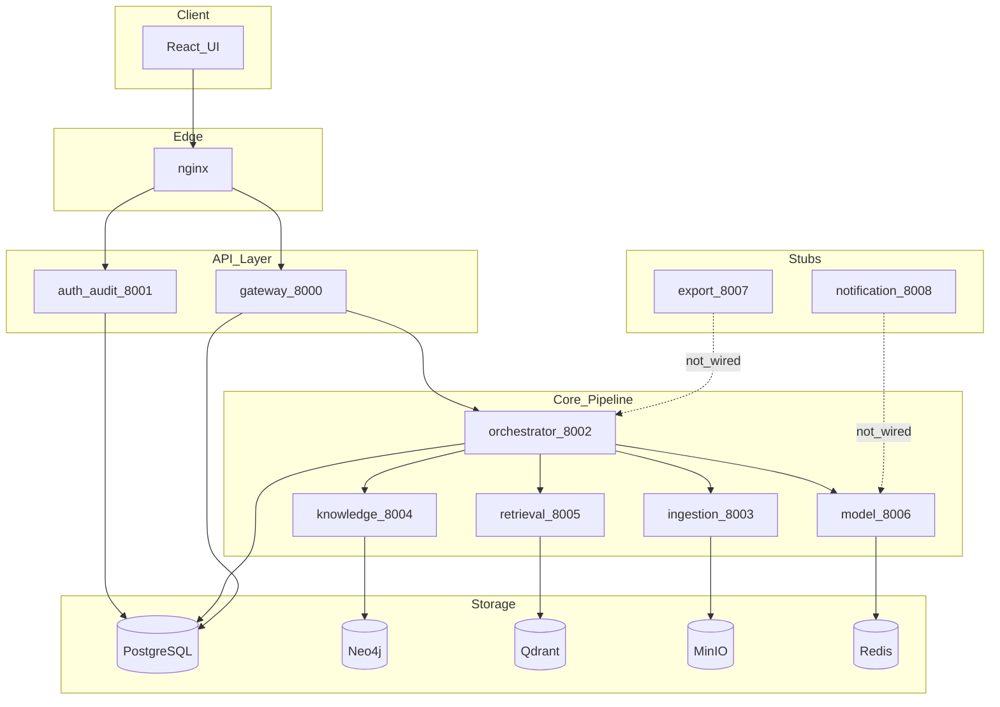
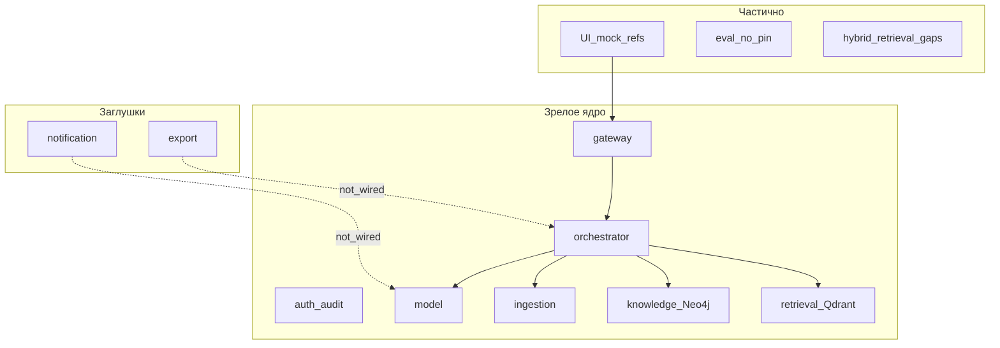

# Отчёт о качестве реализации ScientificTangle

**Дата:** 2026-07-04  
**Статус проекта:** post-MVP (ядро end-to-end реализовано, top-1 фичи частично)  
**Методология:** анализ кода, тестов, инфраструктуры, CI и сверка с [`mvp.md`](../tz/mvp.md), [`ml_mvp_status.md`](ml_mvp_status.md), [`audit_report.md`](audit_report.md).

Этот документ **дополняет**, а не заменяет `audit_report.md` и `ml_mvp_status.md`.

**Пайплайн запроса (детально):** [`query_pipeline.md`](query_pipeline.md).

---

## 1. Резюме

ScientificTangle — evidence-first платформа доказательной карты R&D знаний горно-металлургической отрасли. Архитектура: **9 Python-микросервисов**, **React UI**, **shared contracts**, полный Docker-стек (PostgreSQL, Neo4j, Qdrant, MinIO, Redis, Prometheus/Grafana, nginx).

### Общая оценка

| Область | Оценка (1–5) | Комментарий |
|---------|--------------|-------------|
| Ядро pipeline (ingestion → knowledge → retrieval → query) | **4.5** | Рабочий E2E, реальные Neo4j и Qdrant |
| ML / model service | **4.5** | 13 v1 endpoints, Yandex + deterministic fallback |
| Auth / RBAC / audit | **4.5** | RS256 JWT, 35 тестов |
| Gateway / orchestrator | **4.0** | Полный BFF и пайплайны; orchestrator — монолит ~940 строк |
| UI | **3.5** | 15 страниц, real API на ключевых экранах; mock-зависимости остаются |
| Export / notification | **1.5** | HTTP-заглушки; БД и ML endpoints готовы, wiring отсутствует |
| Тесты / CI | **3.5** | 184 backend-теста, CI green; нет coverage gate, E2E opt-in |
| Ops / infra | **4.0** | Compose, Makefile, monitoring; нет cloud deploy |

### Вердикт

**MVP pipeline реализован** и превосходит типичный хакатон-MVP по архитектурной дисциплине: microservices, единые контракты, evidence-first, реальные граф и векторное хранилище. Главные разрывы post-MVP: **export/notification как сервисы-заглушки**, **mock-зависимости в UI для source refs**, **отсутствие зафиксированного live eval artifact**, **doc drift** в agent context.

Кодовая база готова к итеративному доведению **без архитектурного перелома**.

### Топ-5 сильных сторон

1. **Evidence-first дисциплина** — confirmed claims только с `SourceSpan`; candidate layer с reason codes; 53 Pydantic-модели в `shared/contracts`.
2. **Зрелый model service** — 13 v1 endpoints, prompt/schema registry, eval dataset (4 official + 12 corpus questions), Yandex routing с explicit degraded fallback.
3. **Реальные хранилища** — Neo4jKnowledgeAdapter (write/read subgraph, conflicts, gaps), Qdrant `st_evidence_v1` с `mode=live`.
4. **Production-oriented infra** — DB-per-service, Alembic, Docker secrets для JWT, Prometheus/Grafana, nginx, `scripts/audit_repo.py`.
5. **Auth slice** — полный login/register/refresh/JWKS/RBAC/audit; 35 unit/integration тестов.

### Топ-5 рисков

1. **Export и notification не подключены** — сервисы отдают только `/health`; post-MVP фичи (JSON-LD, уведомления) недоступны через HTTP.
2. **UI зависит от mock catalog** — 10 компонентов импортируют `ui/src/api/mock/` для source refs даже в real-режиме.
3. **Doc drift** — устранён в domain docs и audit_report (2026-07-04); поддерживать при изменениях
4. **Orchestrator god-service** — `service.py` (~940 строк) концентрирует ingestion, query, export proxy; сложно эволюционировать.
5. **Качество не зафиксировано метриками** — нет pinned live eval artifact, pytest-cov, E2E в обязательном CI.

---

## 2. Технологический стек

| Слой | Технологии | Версии / детали | Оценка |
|------|------------|-----------------|--------|
| Backend runtime | Python, FastAPI, uvicorn | 3.12 | Зрелый, единообразный across 9 сервисов |
| Validation / settings | Pydantic v2, pydantic-settings | — | Контракты в `shared/contracts` |
| HTTP client | httpx (async) | — | Межсервисные вызовы |
| Logging | structlog (JSON) | — | Единый `shared/logging` |
| ORM / migrations | SQLAlchemy 2 async, Alembic | — | 13 migration-файлов |
| Graph DB | Neo4j 5 Community | Cypher, query compiler | Live adapter в knowledge |
| Vector DB | Qdrant | Collection `st_evidence_v1`, 256-dim cosine | Live adapter в retrieval |
| Object storage | MinIO | Bucket `source-files` | Ingestion + planned export |
| Cache / queue | Redis 7 | — | Подключён в compose |
| RDBMS | PostgreSQL 16 | DB-per-service (5 баз) | auth_audit, orchestrator, chat_ui, export, notification |
| ML provider | Yandex AI Studio | Embeddings, chat, extraction | Optional via `.env` |
| ML fallback | Deterministic rules | Без скрытых demo-ответов | Явный degraded mode |
| Auth | RS256 JWT, JWKS, refresh cookies | Docker secrets | auth_audit |
| Frontend | React 19, Vite 7, Tailwind 3 | — | i18n ru/en |
| State | Zustand 5 | authStore, theme, locale | — |
| Graph viz | react-force-graph-2d | — | LocalGraph в UI |
| Charts | Recharts 3 | Strategic/lab dashboards | — |
| Edge | nginx | `/api/auth/` → auth_audit, rest → gateway | Basic auth на Grafana |
| Observability | Prometheus, Grafana | `/metrics` на всех сервисах | RED-метрики через `shared/metrics` |
| CI | GitHub Actions | ruff + pytest + vitest | Нет coverage / E2E gate |
| Eval | `eval/run_eval.py` | 16 gold questions | Markdown/JSON reports |

### Архитектура потоков данных



Детальный query path: [`query_pipeline.md`](query_pipeline.md).

---

## 3. Оценка по сервисам

Шкала зрелости: 1 — отсутствует/mock; 2 — stub; 3 — ядро с gaps; 4 — рабочий E2E; 5 — production-ready.

| Сервис | Порт | Зрелость | Тестов | Ключевые файлы | Gaps |
|--------|------|----------|--------|----------------|------|
| **gateway** | 8000 | 4 | 12 | `app/api/query.py`, `graph.py`, `admin.py`; `service/analytics_service.py` | Admin persist; thin strategic/lab tests |
| **auth_audit** | 8001 | 5 | 35 | `app/api/auth.py`, `users.py`; `storage/` Alembic | Rate limiting |
| **orchestrator** | 8002 | 4 | 14 | `app/service/service.py` (940 строк); `api/ingestion.py`, `query.py` | God-service; export proxy без export service |
| **ingestion** | 8003 | 4 | 13 | `app/parsers/`, `service/storage.py`, `api/documents.py` | PDF/DOCX/PPTX/DOC/ZIP — текстовый путь |
| **knowledge** | 8004 | 4 | 20 | `adapters/neo4j_adapter.py`; `api/graph.py` (15 endpoints) | Versioning facts — API есть, review UI нет |
| **retrieval** | 8005 | 4 | 14 | `app/qdrant_adapter.py`, `api/query.py` | Hybrid fusion (graph/table/lexical) не реализован; legacy `api/indexing.py` не смонтирован |
| **model** | 8006 | 5 | 31 | `app/api/v1.py` (13 endpoints), `services.py` | Live eval artifact не pinned |
| **export** | 8007 | 2 | 2 | `app/main.py` — только health | `not_wired` |
| **notification** | 8008 | 2 | 2 | `app/main.py` — только health | `not_wired` |
| **UI** | 3000 | 3.5 | 15 vitest | 15 страниц; `api/client.js`, `auth.js` | Mock source catalog; RoleSwitcher + JWT |

---

## 4. Shared contracts и качество кода

### Сильные стороны

- Пакет `scientific-tangle-shared`: DTO, JWT, errors, metrics, request_id.
- 53 Pydantic-класса в `shared/contracts/models.py`.
- Relative imports в `services/*/app/` — P0-01 закрыт.
- `scripts/audit_repo.py` — **all checks passed** (2026-07-04).
- Agent context: task_router, quality_gate, domain docs.

### Tech debt

| Проблема | Где | Влияние |
|----------|-----|---------|
| Orchestrator god-service | `orchestrator/app/service/service.py` | Сложность эволюции |
| UI mock в production path | SourceLink, EvidenceTable, SourceDocumentContext (10 файлов) | Неверные source refs |
| `VITE_USE_MOCK` default true | `ui/src/api/client.js` | Demo vs real расхождение |
| Admin без persist | `AdminPage.jsx` | Изменения ролей не сохраняются |
| Doc drift | `audit_report.md`, `domains/retrieval.md` | Устаревший статус инфра |
| Нет pytest-cov | CI | Покрытие неизмеряется |
| E2E gated | `RUN_E2E=1` | Не блокирует merge |
| Ruff | 7 fixable import errors | Техдолг lint |

---

## 5. MVP vs фактическое состояние

| Требование MVP | Статус | Доказательство |
|----------------|--------|----------------|
| Полный ingestion pipeline | ✅ | orchestrator → ingestion → knowledge → retrieval |
| NormalizedDocument + SourceSpan | ✅ | shared/contracts, ingestion parsers |
| Claims в Neo4j | ✅ | Neo4jKnowledgeAdapter |
| Chunks в Qdrant | ✅ | `st_evidence_v1`, seed_demo |
| Query IR + hybrid search | ⚠️ | vector + rerank; graph/table/lexical fusion — backlog |
| Ответ в UI | ✅ | ChatPage, AnswerRenderer |
| ≥4 официальных вопроса | ⚠️ | eval runner есть; pinned artifact нет |
| RBAC + access policy | ✅ backend / ⚠️ UI | RoleSwitcher + env auto-login |
| Audit log | ✅ | auth_audit + orchestrator audit |
| Export MD/JSON | ⚠️ | UI client-side; export service — stub |
| Docker reproducibility | ✅ | compose + Makefile + seed |

**MVP checklist: ~85% закрыт.**

---

## 6. Что доделать (приоритетный backlog)

Без привязки к срокам — всё в текущем цикле разработки.

### P0 — продуктовые дыры

| # | Задача | Размер |
|---|--------|--------|
| 1 | Export service wiring — HTTP API, orchestrator proxy, JSON-LD из model | M |
| 2 | Notification service wiring — interests CRUD, model `/notifications/match` | M |
| 3 | Live eval artifact — pin `eval/reports/` на demo corpus | S |
| 4 | UI source catalog — заменить mock refs на gateway/source API | M |

### P1 — качество и доверие

| # | Задача | Размер |
|---|--------|--------|
| 5 | E2E в CI — compose job: stack health + 1 official question | M |
| 6 | Access filtering live gate — eval метрика в CI | S |
| 7 | p50/p95 benchmarks — расширить `scripts/perf_smoke.py` | S |
| 8 | pytest-cov threshold — минимум 60% на core services | S |

### P2 — архитектура и polish

| # | Задача | Размер |
|---|--------|--------|
| 9 | Разбить OrchestratorService на runners | L |
| 10 | Синхронизировать docs при изменениях сервисов | S |
| 11 | UI auth UX — RoleSwitcher только dev; prod — JWT session | M |
| 12 | Review console / versioning facts (top-1) | L |

### P3 — опционально

- Server-side PDF export
- Cloud deploy / HTTPS / submission artifacts
- Evaluation dashboard UI

---

## 7. Тестирование и observability

### Backend-тесты

| Suite | Тестов |
|-------|--------|
| shared | 20 |
| auth_audit | 35 |
| gateway | 12 |
| orchestrator | 14 |
| ingestion | 13 |
| knowledge | 20 |
| retrieval | 14 |
| model | 31 |
| export | 2 |
| notification | 2 |
| integration | 10 |
| e2e | 10 |
| performance | 1 |
| **Итого** | **184** |

`python scripts/run_tests.py` (2026-07-04): all backend test suites passed.

### Observability

- structlog JSON, Prometheus `/metrics`, Grafana dashboards
- `X-Request-ID` сквозной; `QueryRun.latency_ms`, `retrieval_trace`

---

## 8. Безопасность

**Реализовано:** RS256 JWT, JWKS, refresh, RBAC, access filter до synthesis, Docker secrets, audit events.

**Риски:** env auto-login (`VITE_AUTH_USERNAME/PASSWORD`), RoleSwitcher в prod UI, admin без persist, нет rate limiting в gateway.

---

## 9. Инфраструктура и CI

- Docker Compose: PostgreSQL, Neo4j, Qdrant, MinIO, Redis, 9 backend + UI + nginx + Prometheus + Grafana
- CI: ruff + pytest (`run_tests.py`) + vitest
- Gaps: coverage gate, E2E compose job

---

## 10. Расхождения с документацией

| Документ | Утверждение | Факт в коде |
|----------|-------------|-------------|
| `domains/export.md` | `not_wired` | Актуально |
| `domains/notification.md` | `not_wired` | Актуально |
| `docs/tz/mvp.md` | Только DoD без статуса | Обновлён чеклист vs код |

---

## 11. Матрица зрелости

| Домен | Итог (1–5) |
|-------|------------|
| Ingestion | 4 |
| Knowledge / Neo4j | 4 |
| Retrieval / Qdrant | 4 |
| ML / Model | 5 |
| Auth / Audit | 5 |
| Gateway / BFF | 4 |
| Orchestrator | 4 |
| UI | 3.5 |
| Export | 2 |
| Notification | 2 |
| Ops / Infra | 4 |
| Tests / CI | 3.5 |
| Eval / Quality gates | 3 |



---

## 12. Связанные документы

| Документ | Назначение |
|----------|------------|
| [`query_pipeline.md`](query_pipeline.md) | Полный пайплайн запроса user → answer |
| [`docs/tz/mvp.md`](../tz/mvp.md) | Definition of Done MVP |
| [`audit_report.md`](audit_report.md) | P0/P1 аудит репозитория |
| [`ml_mvp_status.md`](ml_mvp_status.md) | Статус ML MVP |
| [`docs/02_architecture.md`](../02_architecture.md) | Архитектурная карта |

---

## Приложение A. Метрики (2026-07-04)

```
python scripts/audit_repo.py          → all checks passed
python scripts/run_tests.py           → all backend test suites passed
ruff check                            → 7 fixable import errors
pytest --collect-only                 → 184 tests
Alembic migrations                    → 13 files
shared/contracts Pydantic classes     → 53
model v1 HTTP endpoints               → 13
knowledge graph HTTP endpoints        → 15
orchestrator service.py lines         → 940
UI pages                              → 15
UI vitest files                       → 15
eval gold questions                   → 16 (4 official MVP)
UI files importing api/mock           → 10
```
