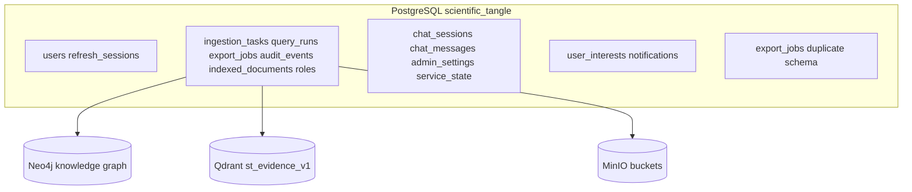

# НорСинтез E0: storage baseline (Databases)

**Дата:** 2026-07-04  
**Ветка:** `feat/nornikel-e0-db-baseline`  
**Этап:** E0 — baseline и аудит  
**Область:** PostgreSQL (Alembic), MinIO, Neo4j, Qdrant, seed/reset scripts

Связанные документы: [`nornikel_parallel_execution_plan.md`](nornikel_parallel_execution_plan.md), [`audit_report.md`](audit_report.md), [`project_structure.md`](project_structure.md).

---

## 1. Цель и метод

Зафиксировать текущее состояние storage-слоя для фич review, interests, notifications, export, document deletion, admin save, audit pagination и source spans. Новые миграции **не добавлялись** — только аудит по коду и существующим Alembic-ревизиям на `origin/dev`.

Проверено:

- Alembic-миграции в `services/*/storage/` и `infra/postgres/*/storage/`
- SQLAlchemy-модели в `infra/postgres/*_db/models.py`
- Neo4j `constraints.cypher`, `indexes.cypher`
- Qdrant `infra/qdrant/README.md`
- MinIO `infra/minio/buckets.txt`
- Seed/reset: `scripts/reset_pg_demo.py`, `scripts/migrate_pg_layers.py`, `infra/postgres/*/seed.py`, `Makefile` targets `seed` / `reset-demo`

### Физическая vs логическая схема PostgreSQL

| Факт | Детали |
|------|--------|
| Docker-compose | Один инстанс PostgreSQL, БД `scientific_tangle` (`st_user` / `st_pass`) |
| Логические слои | `auth_audit_db`, `orchestrator_db`, `chat_ui_db`, `notification_db`, `export_db` — отдельные Alembic-цепочки, таблицы сосуществуют в одной БД |
| Применение миграций | `auth_audit`, `orchestrator` — `alembic upgrade head` при старте контейнера; `chat_ui_db`, `notification_db` — при старте `gateway`; `export_db` — **не применяется автоматически** в compose |
| Скрипт all-in-one | `scripts/migrate_pg_layers.py` — все 5 цепочек |

---

## 2. Карта миграций (существующие)

### 2.1 auth_audit (`services/auth_audit/storage/`)

| Ревизия | Таблицы / изменения | Владелец |
|---------|---------------------|----------|
| `0001` | `users`, `refresh_sessions` | `auth_audit` |
| `0002` | `users.deactivated_at`, unique `email` | `auth_audit` |

Product audit (query/export/review) **не** в auth_audit — только identity lifecycle audit sink (`LoggingAuthAuditSink`).

### 2.2 orchestrator (`services/orchestrator/storage/`)

| Ревизия | Таблицы / изменения | Владелец |
|---------|---------------------|----------|
| `0001` | `ingestion_tasks` (+ report, error_message) | `orchestrator` |
| `0002` | `query_runs`, `export_jobs` (базовая схема) | `orchestrator` |
| `0003` | reconcile legacy query_runs | `orchestrator` |
| `0004` | `roles`, `permissions`, `role_permissions`, `audit_events`, `indexed_documents`; расширение `query_runs` | `orchestrator` |
| `0005` | E2E-колонки `query_runs` (raw_question, evidence_bundle, answer, …) | `orchestrator` |
| `0006` | reconcile runtime schema; `export_jobs.query_run_id`, `export_jobs.payload` | `orchestrator` |
| `0007` | `ingestion_tasks.task_kind`, `dictionary_version_id`; `query_runs.dictionary_version_id` | `orchestrator` |

Модели: `infra/postgres/orchestrator_db/models.py` — `IngestionTask`, `QueryRun`, `ExportJob`, `AuditEvent`, RBAC-таблицы.

### 2.3 chat_ui_db (`infra/postgres/chat_ui_db/storage/`)

| Ревизия | Таблицы | Владелец |
|---------|---------|----------|
| `0001` | `chat_sessions`, `chat_messages`, `admin_settings`, `service_state` | `gateway` |

### 2.4 notification_db (`infra/postgres/notification_db/storage/`)

| Ревизия | Таблицы | Владелец |
|---------|---------|----------|
| `0001` | `user_interests`, `notifications` | `gateway` (через `NotificationRepository`) |

Seed: `infra/postgres/notification_db/seed.py` — demo notifications + interests для `researcher`.

### 2.5 export_db (`infra/postgres/export_db/storage/`)

| Ревизия | Таблицы | Владелец |
|---------|---------|----------|
| `0001` | `export_jobs` (упрощённая схема без `query_run_id`, `payload`) | `export` service (**stub**, не wired) |

Seed: `infra/postgres/export_db/seed.py` — один demo job; миграции в compose **не запускаются**.

---

## 3. MinIO

Источник: `infra/minio/buckets.txt`

| Bucket | Назначение | Статус для фич |
|--------|------------|----------------|
| `source-files` | Исходные документы ingestion | delete document (E2–E3) |
| `normalized-artifacts` | Нормализованные артефакты | delete cascade |
| `exports` | Артефакты export jobs | export (E5) — bucket есть, metadata в PG не формализована |
| `demo-archives` | Demo corpus | seed/eval |
| `temp-files` | Временные файлы | cleanup TBD |

**Gap:** нет таблицы/метаданных MinIO object refs для cascade delete и export artifact lifecycle.

---

## 4. Neo4j

Источник: `infra/neo4j/constraints.cypher`, `indexes.cypher`, `services/knowledge/adapters/queries.py`

### Labels и constraints (релевантные фичам)

| Label | Constraint | Роль |
|-------|------------|------|
| `SourceSpan` | `source_span_id` UNIQUE | source spans, provenance |
| `Document` | `document_id` UNIQUE | document catalog, access_level index |
| `Claim` | `claim_id` UNIQUE | evidence, review candidates |
| `CandidateEntity` | `candidate_id` UNIQUE | review queue (graph side) |
| `CandidateRelation` | `candidate_id` UNIQUE | review queue |
| `CandidateClass` | `candidate_id` UNIQUE | review queue |
| `ReviewDecision` | `decision_id` UNIQUE | review decisions (graph-only) |

### SourceSpan properties (Neo4j DTO)

`SourceSpanDTO` / `WRITE_SOURCE_SPAN`: `document_id`, `page_number`, `raw_text`, `char_start`, `char_end`, `source_type`, `table_block_id`.

Индексы на `SourceSpan` node properties **отсутствуют** в `indexes.cypher` (только constraint по `source_span_id`).

### Review state

- Кандидаты и решения пишутся в Neo4j (`WRITE_REVIEW_DECISION`, `CandidateEntity` MERGE).
- **Нет** PostgreSQL-таблицы `review_decisions` / `review_queue` для durable product workflow и пагинации.

---

## 5. Qdrant

Источник: `infra/qdrant/README.md`, retrieval bootstrap

| Параметр | Значение |
|----------|----------|
| Collection | `st_evidence_v1` |
| Vector | size 256, Cosine |
| Keyword indexes | `document_id`, `source_span_id`, `source_type`, `access_level`, `table_block_id`, … |
| Float indexes | `numeric_min`, `numeric_max` |

Source spans в Qdrant — через payload `source_span_id`, `document_id`; отдельной PG-таблицы spans нет.

**Gap:** `table_row_id` в payload/contracts нет; highlight — через offsets в shared `SourceSpan` (`start_offset`/`end_offset`), не `highlight_start`/`highlight_end`.

---

## 6. Seed / reset

| Скрипт | Что покрывает | Gaps |
|--------|---------------|------|
| `scripts/migrate_pg_layers.py` | Все 5 PG Alembic chains | `export_db` может не применяться в runtime compose |
| `scripts/reset_pg_demo.py` | TRUNCATE списка таблиц в одной БД | Нет Neo4j/Qdrant/MinIO reset; список таблиц может отставать от миграций |
| `make seed` | auth users + notification seed + `seed_demo.py` (corpus ingest через API) | notifications seed-only в demo |
| `make reset-demo` | reset PG + re-seed | без graph/vector/object store |
| `infra/postgres/notification_db/seed.py` | `user_interests`, `notifications` | hardcoded demo messages |
| `infra/postgres/export_db/seed.py` | один `export_jobs` row | не в основном seed flow |

---

## 7. Потребности по фичам vs текущее покрытие

### 7.1 Review

| Требование (E1–E3) | Есть сейчас | Gap | Owner этапа |
|--------------------|-------------|-----|-------------|
| Review queue (candidates) | Neo4j `CandidateEntity/Relation/Class` | Нет PG queue state, нет API storage index | E1 DB + E2 DB |
| Review decisions | Neo4j `ReviewDecision` node + constraint | Нет PG `review_decisions`; нет связи candidate↔decision в PG | E1 DB |
| Фильтры type/status/date | — | Нет индексов/полей в PG | E1 DB |
| Audit `review_decision` | `audit_events` (generic JSONB details) | action enum не формализован | E5 BML |

### 7.2 Interests (профиль)

| Требование | Есть сейчас | Gap | Owner |
|------------|-------------|-----|-------|
| `user_interests` table | **Да** — migration `notification_db/0001` | — | — |
| `raw_text`, `extracted_entities` JSONB | **Да** | Отдельная таблица extracted entities не нужна на E0 (JSONB достаточно) | E1 если нормализация |
| Unique per user | `ix_user_interests_user_id` UNIQUE | — | — |
| Repository wiring | `SqlAlchemyNotificationRepository.update_user_interests` | GET interests endpoint storage-ready | E3 BML |

### 7.3 Notifications

| Требование | Есть сейчас | Gap | Owner |
|------------|-------------|-----|-------|
| `notifications` table | **Да** — migration `notification_db/0001` | — | — |
| `type`, `reference_id`, `message`, `is_read` | **Да** | `reference_type` **отсутствует** | E1 DB |
| Incremental `?since=` poll | Index `created_at` | Нет composite `(user_id, created_at)`; нет cursor id | E3/E5 DB |
| Match result persistence | — | Нет таблицы notification match results | E1 DB |
| Real event source | Seed-only demo | Production flow не на storage | E3/E5 BML |

### 7.4 Export jobs

| Требование | Есть сейчас | Gap | Owner |
|------------|-------------|-----|-------|
| `export_jobs` в orchestrator | **Да** — `0002` + `0006` (`query_run_id`, `payload`) | Authoritative owner = orchestrator | E5 boundary doc |
| `export_jobs` в export_db | Дубликат схемы `0001` | Не wired; риск drift | E1/E5 DB |
| MinIO `exports` bucket | **Да** | Нет PG metadata для artifact refs/retention | E5 DB |
| Formats pdf/md/json/json-ld | CHECK в export_db; orchestrator model enum | PDF/JSON-LD product status TBD | E5 BML |

### 7.5 Document deletion

| Требование | Есть сейчас | Gap | Owner |
|------------|-------------|-----|-------|
| Document registry | `indexed_documents` (orchestrator `0004/0006`) | Нет `deleted_at` / tombstone / cascade status | E1 DB |
| Neo4j Document node | `Document` label + `access_level` index | Нет deletion marker | E2 DB |
| Qdrant vectors | payload `document_id` | Deindex workflow storage TBD | E2 DB |
| MinIO objects | `source-files` bucket | Нет object ref table | E2 DB |
| Cascade metadata | — | Полностью отсутствует | E2 DB |

### 7.6 Admin save

| Требование | Есть сейчас | Gap | Owner |
|------------|-------------|-----|-------|
| Settings persistence | `admin_settings` (chat_ui `0001`) | — | — |
| Unique key index | `ix_admin_settings_key` UNIQUE | — | — |
| Admin change audit | Generic `audit_events` | Нет dedicated audit subtype/fields | E3/E5 |
| Versioning / diff | JSONB `setting_value` only | Нет history table | backlog |

### 7.7 Audit pagination

| Требование | Есть сейчас | Gap | Owner |
|------------|-------------|-----|-------|
| `audit_events` table | **Да** — orchestrator `0004/0006` | — | — |
| Indexes user/action/created_at | **Да** | — | — |
| Offset pagination | `list_audit_events(limit, offset)` | Работает для MVP | — |
| Cursor pagination | — | **Отсутствует** (`since_id` / `created_at` cursor) | E3/E5 DB |
| CSV export storage | — | Нет | E5 DB |
| auth_audit identity audit | Logging sink only | Не в PG product audit | by design |

### 7.8 Source spans

| Требование | Есть сейчас | Gap | Owner |
|------------|-------------|-----|-------|
| Stable ID | `shared/contracts.SourceSpan` + `compute_source_span_id` | — | — |
| Offsets / page | `start_offset`, `end_offset`, `page` | UI plan mentions `highlight_*` — alias mapping в BML, не DB | E2 BML/FE |
| Table context | `table_block_id` in contract + Neo4j | `table_row_id` **нет** | E2 DB |
| PG lookup table | — | Spans только Neo4j + Qdrant payload | E2 если нужен PG index |
| `indexed_documents.source_spans_count` | aggregate only | Нет per-span PG | E2 |

---

## 8. Сводная таблица storage gaps

| Фича | Покрыто миграциями | Критичный gap | Целевой этап (план) |
|------|-------------------|---------------|---------------------|
| Review | Neo4j only | PG review_decisions + queue indexes | E1, E2 |
| Interests | `user_interests` ✅ | — (storage-ready) | E3 wiring |
| Notifications | `notifications` ✅ | `reference_type`, since/cursor, match results | E1, E3, E5 |
| Export | orchestrator `export_jobs` ✅ | duplicate export_db; MinIO artifact metadata | E1 boundary, E5 |
| Delete document | `indexed_documents` partial | tombstone, cascade status, cross-store refs | E1, E2 |
| Admin save | `admin_settings` ✅ | audit trail for changes | E3 |
| Audit | `audit_events` ✅ | cursor pagination, CSV | E3, E5 |
| Source spans | Neo4j + Qdrant + contract | `table_row_id`; PG lookup optional | E2 |

---

## 9. Existing migrations — что уже закрывает план E1

Следующие сущности **уже есть** и не требуют новых миграций на E0 (E1 — доработка, не дублирование):

- `UserInterest` — `infra/postgres/notification_db/storage/versions/0001_create_notification_tables.py`
- `Notification` — та же миграция
- `ExportJob` (authoritative) — `services/orchestrator/storage/versions/0002` + `0006`
- `audit_events` — `services/orchestrator/storage/versions/0004` / `0006`
- Review graph primitives — Neo4j constraints (`ReviewDecision`, `Candidate*`) — без PG
- `admin_settings` — `infra/postgres/chat_ui_db/storage/versions/0001`
- `indexed_documents` — orchestrator `0004` / `0006` (deletion metadata — нет)

**Не создавать на E0:** новые Alembic-ревизии (только этот отчёт).

---

## 10. Риски и зависимости

| ID | Риск | Влияние | Рекомендация |
|----|------|---------|--------------|
| R-01 | Два `export_jobs` (orchestrator vs export_db) | schema drift, путаница владельца | E1: зафиксировать orchestrator authoritative; export_db — deprecate или E5 full service |
| R-02 | `export_db` миграции не в compose CMD | таблица может отсутствовать при ручном вызове export seed | `migrate_pg_layers.py` или удалить дубликат |
| R-03 | Single PG DB для всех слоёв | TRUNCATE CASCADE в reset затрагивает все сервисы | документировать в E6 seed reliability |
| R-04 | Review только в Neo4j | нет transactional PG+graph review workflow | E2 review queue storage |
| R-05 | reset без Neo4j/Qdrant/MinIO | stale vectors/graph после PG reset | E6 backup/restore gap report |

**Зависимости от других ролей E0:** нет (аудит автономный).  
**blocked_by_policy:** не применимо (live models не вызывались).

---

## 11. Минимальный quality gate (карточка)

| Проверка | Результат |
|----------|-----------|
| Новые миграции | Не добавлялись (E0 policy) |
| Production behavior | Не менялся |
| `git diff --check` | Выполнить перед коммитом |
| DB tests | Не требуются (только документация) |
