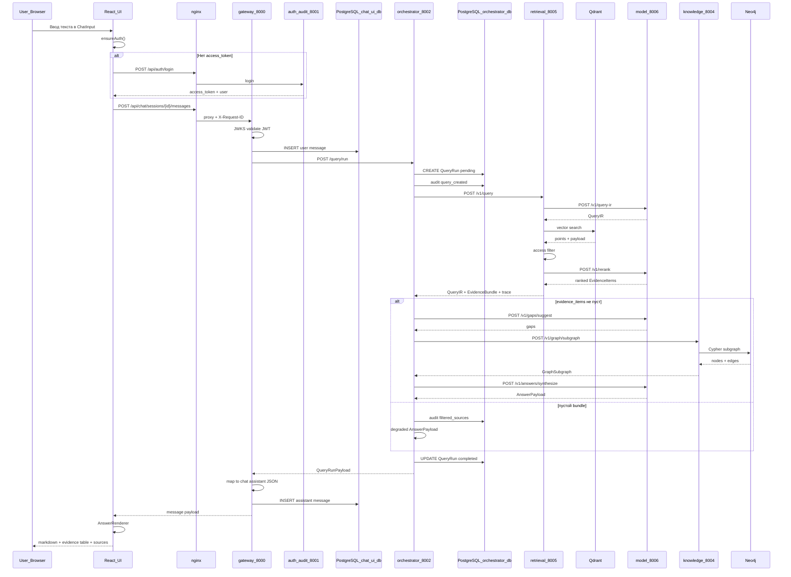
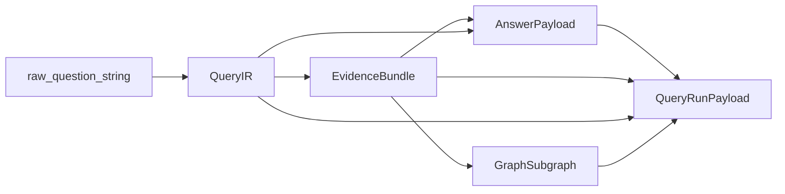
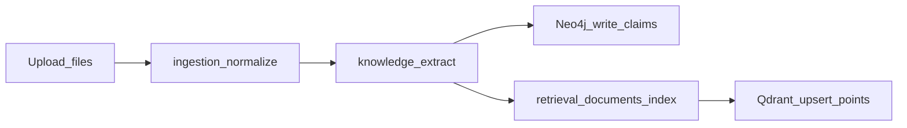

# Пайплайн запроса: от ввода пользователя до ответа

**Дата:** 2026-07-04  
**Область:** полный путь пользовательского вопроса через все слои системы ScientificTangle.

Связанные документы: [`implementation_quality_report.md`](implementation_quality_report.md), [`docs/02_architecture.md`](../02_architecture.md).

---

## 1. Обзор

Пользователь задаёт вопрос в чате (или напрямую через API). Система:

1. Аутентифицирует запрос (JWT RS256).
2. Сохраняет сообщение в PostgreSQL (`chat_ui_db`).
3. Строит **Query IR** из текста вопроса (model service).
4. Ищет доказательства в **Qdrant** с учётом роли (retrieval).
5. Переранжирует evidence (model service).
6. Предлагает gaps по покрытию (model service).
7. Строит **локальный subgraph** по claim/entity/source_span (knowledge / Neo4j).
8. Синтезирует ответ только из **EvidenceBundle** (model service).
9. Сохраняет **QueryRun** в PostgreSQL (`orchestrator_db`).
10. Возвращает ответ в UI: текст, таблица evidence, источники, предупреждения.

**Принцип:** confirmed факты только с `SourceSpan`; синтез не видит весь корпус — только отфильтрованный `EvidenceBundle`.

**Предусловие:** корпус проиндексирован ingestion-пайплайном (MinIO → normalize → knowledge/Neo4j → retrieval/Qdrant). Без индекса retrieval вернёт пустой bundle → orchestrator отдаст деградированный ответ.

---

## 2. Точки входа

| Вход | HTTP | Кто вызывает |
|------|------|--------------|
| **Чат (основной UI)** | `POST /api/chat/sessions/{id}/messages` | `ChatPage` → `sendChatMessage()` |
| **Прямой query API** | `POST /api/query` | eval runner, интеграционные тесты, внешние клиенты |
| **Поиск (без синтеза)** | `GET /api/search` | `SearchPage` — только retrieval, без model synthesis |

Ниже описан **полный query-пайплайн** (чат и прямой `/api/query` сходятся на orchestrator).

---

## 3. Сквозная диаграмма (sequence)



---

## 4. Пошаговый разбор по слоям

### Шаг 0. Edge и маршрутизация

| Слой | Компонент | Действие |
|------|-----------|----------|
| Edge | `infra/nginx/nginx.conf` | `/api/auth/` → `auth_audit:8001`; `/api/` → `gateway:8000`; статика UI → `ui:3000` |
| Edge | nginx | Пробрасывает `X-Request-ID` (или генерирует из connection) |
| UI | `ui/vite.config.js` | Dev-proxy `/api` → gateway |
| UI | `ui/src/api/client.js` | `VITE_API_URL` или `/api`; `{ real: true }` отключает mock |

---

### Шаг 1. UI — ввод и отправка

| # | Слой | Файл | Действие |
|---|------|------|----------|
| 1.1 | Page | `ui/src/pages/ChatPage.jsx` | `handleSend({ text })` — optimistic UI message |
| 1.2 | Auth | `ui/src/api/auth.js` | `ensureAuth()` — Bearer token из store или `POST /api/auth/login` |
| 1.3 | API | `ui/src/api/chat.js` | `sendChatMessage(sessionId, content)` |
| 1.4 | HTTP | axios | `POST /api/chat/sessions/{sessionId}/messages` body: `{ content }` |
| 1.5 | Headers | `client.js` | `Authorization: Bearer <access_token>` |

**Альтернатива:** `POST /api/query` с `{ question, filters, limit }` — минует chat_db, сразу возвращает `QueryRunPayload`.

---

### Шаг 2. Gateway — BFF (порт 8000)

| # | Слой | Файл / endpoint | Действие |
|---|------|-----------------|----------|
| 2.1 | Middleware | `shared/web/request_id.py` | `request_id_middleware` → `request.state.request_id` |
| 2.2 | Auth | `shared/web/auth.py` | `require_principal` → `JWKSValidator.validate(token)` |
| 2.3 | JWKS | `shared/security/jwt.py` | Загрузка ключей с `auth_audit` `/.well-known/jwks.json` |
| 2.4 | Route | `gateway/app/api/chat.py` | `POST /chat/sessions/{id}/messages` |
| 2.5 | Service | `gateway/app/service/chat_service.py` | `save_message(user)` → `run_query` → `save_message(assistant)` |
| 2.6 | Proxy | `gateway/app/service/service.py` | `POST {orchestrator}/query/run` + `Authorization` + `X-Request-ID` |
| 2.7 | Storage | `infra/postgres/chat_ui_db/` | `ChatSession`, `ChatMessage` в PostgreSQL |
| 2.8 | Mapping | `chat_service._map_query_response` | `QueryRunPayload` → JSON для UI: `content`, `evidence_table`, `sources`, `warnings` |

**DTO на вход orchestrator:** `{ question, filters: {}, limit: 20 }`.

**Прямой путь:** `gateway/app/api/query.py` → `POST /query` → тот же `GatewayService.run_query` без записи в chat_db.

---

### Шаг 3. Orchestrator — координация (порт 8002)

| # | Слой | Файл | Действие |
|---|------|------|----------|
| 3.1 | Auth | `orchestrator/app/main.py` | Собственный `JWKSValidator` на internal routes |
| 3.2 | Route | `orchestrator/app/api/query.py` | `POST /query/run` |
| 3.3 | Service | `orchestrator/app/service/service.py` | `run_query(principal, question, filters, request_id, limit)` |
| 3.4 | DB | `infra/postgres/orchestrator_db/repository.py` | `QueryRunRepository.create` → status `pending` |
| 3.5 | Audit | orchestrator DB | `record_audit_event("query_created", ...)` |
| 3.6 | DB | repository | `mark_processing` → status `processing` |
| 3.7 | HTTP | `_request_downstream` | `POST retrieval:8005/v1/query` |

**Тело запроса в retrieval:**

```json
{
  "question": "<текст вопроса>",
  "filters": {},
  "access_roles": ["<роль из JWT>"],
  "limit": 20
}
```

---

### Шаг 4. Retrieval — поиск и fusion (порт 8005)

**Файл:** `services/retrieval/app/api/query.py` → `run_query`

| # | Подшаг | Вызов | Результат |
|---|--------|-------|-----------|
| 4.1 | Query IR | `POST model:8006/v1/query-ir` `{ raw_query, limit }` | `QueryIR`: entities, filters, numeric/geo constraints |
| 4.2 | Merge filters | retrieval | `query_ir.filters` += request.filters |
| 4.3 | Vector search | `QdrantRetrievalStorageAdapter.search` | `POST qdrant/collections/st_evidence_v1/points/search` |
| 4.4 | Embeddings | `qdrant_adapter._embed` | `POST model/v1/embeddings` input_type=query, dim=256 |
| 4.5 | Access filter #1 | `payload_allowed` + `access_allowed` | Отсекает точки по `access_level`, `allowed_roles` |
| 4.6 | Evidence build | retrieval | `EvidenceItem` per allowed hit: `source_span`, `claim_ids`, `entity_ids`, score |
| 4.7 | Rerank | `POST model/v1/rerank` | `{ query_ir, evidence_items, limit }` |
| 4.8 | Access filter #2 | retrieval | Reranked items ⊆ allowed `source_span.id` |
| 4.9 | Bundle | retrieval | `EvidenceBundle`: `query_ir`, `evidence_items`, `total_found`, `has_gaps` |

**Хранилище Qdrant:**

- Collection: `st_evidence_v1`
- Vector: 256-dim cosine
- Payload: `source_span_id`, `document_id`, `text`, `claim_ids`, `graph_entity_ids`, `access_level`, `allowed_roles`, `numeric_*`, `geo_*`, `lexical_tokens`

**Ответ retrieval → orchestrator:**

```json
{
  "query_ir": { ... },
  "evidence_bundle": { ... },
  "retrieval_trace": {
    "storage": "qdrant",
    "retrieved": N,
    "accessible": M,
    "reranked": K
  },
  "warnings": []
}
```

---

### Шаг 5. Orchestrator — post-retrieval (при непустом evidence)

| # | Подшаг | Вызов | Назначение |
|---|--------|-------|------------|
| 5.1 | Gaps | `POST model/v1/gaps/suggest` | Проверка покрытия numeric/geo/time constraints |
| 5.2 | Graph | `POST knowledge/v1/graph/subgraph` | Локальный subgraph по IDs из evidence |
| 5.3 | Synthesis | `POST model/v1/answers/synthesize` | Текст ответа только из bundle |
| 5.4 | Warnings | orchestrator | Слияние warnings из retrieval, gaps, synthesis, unsupported_claim |

**Тело subgraph в knowledge:**

```json
{
  "claim_ids": ["..."],
  "entity_ids": ["..."],
  "source_span_ids": ["..."]
}
```

---

### Шаг 6. Knowledge — граф (порт 8004)

| # | Слой | Компонент | Действие |
|---|------|-----------|----------|
| 6.1 | Route | `knowledge/app/api/graph.py` | `POST /v1/graph/subgraph` |
| 6.2 | Adapter | `adapters/neo4j_adapter.py` | Cypher: узлы claims, entities, spans; рёбра provenance |
| 6.3 | Storage | Neo4j 5 | Constraints/indexes из `infra/neo4j/` |
| 6.4 | Contract | `shared/contracts` | `GraphSubgraph`: `nodes`, `edges`, metadata |

**Не вызывается в query path (но доступно отдельно):** `/conflicts`, `/gaps`, `/neighbors`, `/resolve-alias`, Query IR compiler.

---

### Шаг 7. Model service — ML-слой (порт 8006)

Endpoints, участвующие в query pipeline:

| Endpoint | Вход | Выход | Когда |
|----------|------|-------|-------|
| `POST /v1/query-ir` | `raw_query`, `limit` | `QueryIR` | retrieval шаг 4.1 |
| `POST /v1/embeddings` | `texts`, `dimensions=256`, `input_type` | vectors | retrieval search/index |
| `POST /v1/rerank` | `query_ir`, `evidence_items` | `scored_items` | retrieval шаг 4.7 |
| `POST /v1/gaps/suggest` | `query_ir`, `evidence_bundle` | `gaps[]` | orchestrator шаг 5.1 |
| `POST /v1/answers/synthesize` | `query_ir`, `evidence_bundle` | `AnswerPayload` | orchestrator шаг 5.3 |

**Провайдер:** Yandex AI Studio при наличии `YANDEX_API_KEY` / `YANDEX_FOLDER_ID`; иначе deterministic fallback (`services/model/app/services.py`).

**Evidence-first:** synthesis не продвигает candidates без `SourceSpan` в confirmed слой.

---

### Шаг 8. Orchestrator — завершение и персистенция

| # | Действие | Storage |
|---|----------|---------|
| 8.1 | `mark_completed(run, query_ir, evidence_bundle, answer, graph, trace, warnings, latency_ms)` | `orchestrator_db.QueryRun` |
| 8.2 | Поля QueryRun | `raw_question`, `query_ir`, `evidence_bundle`, `answer`, `graph_subgraph`, `retrieval_trace`, `warnings`, `latency_ms`, `status=completed` |
| 8.3 | `_query_payload(run)` | → `QueryRunPayload` (shared contract) |
| 8.4 | При ошибке | `mark_failed` + `OrchestratorServiceError` с `query_run_id` |

**При пустом evidence_bundle:**

- Audit: `filtered_sources`
- Answer: `"Недостаточно доступных доказательств..."`, `confidence=0`, `model_used=none`
- Gaps: `insufficient_accessible_evidence`

---

### Шаг 9. Gateway — ответ в чат

| # | Действие | Детали |
|---|----------|--------|
| 9.1 | `_map_query_response` | Таблица evidence: колонки «Параметр / Фрагмент / Источник», до 8 строк |
| 9.2 | `save_message` role=assistant | JSON в `ChatMessage.content` |
| 9.3 | HTTP 200 | `{ id, role: assistant, content, sources, evidence_table, warnings, confidence }` |

---

### Шаг 10. UI — рендеринг ответа

| # | Компонент | Файл | Что показывает |
|---|-----------|------|----------------|
| 10.1 | ChatWindow | `components/chat/ChatWindow.jsx` | Список сообщений |
| 10.2 | AnswerRenderer | `components/chat/AnswerRenderer.jsx` | Markdown текст ответа |
| 10.3 | EvidenceTable | `components/chat/EvidenceTable.jsx` | Таблица доказательств |
| 10.4 | SourceCitation | `components/chat/SourceCitation.jsx` | Ссылки на источники |
| 10.5 | SynonymTransparency | `components/chat/SynonymTransparency.jsx` | Entities из QueryIR |
| 10.6 | WarningsPanel | `components/chat/WarningsPanel.jsx` | Confidence / предупреждения |

**Примечание:** часть source refs в UI всё ещё резолвится через `ui/src/api/mock/sourceCatalog.js` при открытии документа — это не часть backend pipeline, но влияет на UX просмотра источника.

---

## 5. Смежные post-query потоки

После получения ответа пользователь может:

| Действие | UI → API | Backend chain | Storage |
|----------|----------|---------------|---------|
| Открыть источник | SourceLink / modal | `GET /api/source/{source_span_id}` → orchestrator → `POST retrieval/v1/sources/{id}/resolve` | Qdrant payload |
| Локальный граф | GraphPage | `GET /api/graph/subgraph?run_id=` → orchestrator `get_run` → `graph_subgraph` из QueryRun | orchestrator_db (кэш в run) |
| Экспорт MD/JSON | ExportPanel | `POST /api/export` → orchestrator `export_query_run` | orchestrator_db ExportJob; формат в памяти |
| Повторный запрос run | — | `GET /api/runs/{run_id}` | orchestrator_db |
| Поиск без синтеза | SearchPage | `GET /api/search` → orchestrator → `POST retrieval/v1/search` | Qdrant only |

---

## 6. Карта сервисов и портов в query path

| Сервис | Порт | Участие в query | Роль |
|--------|------|-----------------|------|
| **nginx** | 80 | ✅ | Reverse proxy, request_id |
| **ui** | 3000 | ✅ | Ввод/рендер; не в data plane |
| **gateway** | 8000 | ✅ | JWT, chat_db, proxy orchestrator |
| **auth_audit** | 8001 | ✅ (косвенно) | Login, JWKS, RBAC claims в JWT |
| **orchestrator** | 8002 | ✅ | Координация, QueryRun, audit |
| **retrieval** | 8005 | ✅ | Query IR delegate, Qdrant, rerank |
| **model** | 8006 | ✅ | query-ir, embeddings, rerank, gaps, synthesize |
| **knowledge** | 8004 | ✅ (если есть evidence) | Subgraph из Neo4j |
| **ingestion** | 8003 | ❌ в query | Только при предварительной загрузке корпуса |
| **export** | 8007 | ❌ в query | Заглушка; export через orchestrator in-memory |
| **notification** | 8008 | ❌ | Не в query path |

---

## 7. Хранилища и что читается при запросе

| Хранилище | База / ключ | Чтение в query | Запись в query |
|-----------|-------------|----------------|----------------|
| PostgreSQL `chat_ui_db` | sessions, messages | — | user + assistant messages |
| PostgreSQL `orchestrator_db` | query_runs, audit_events | — | QueryRun, audit |
| Qdrant `st_evidence_v1` | vectors + payload | ✅ search | ❌ |
| Neo4j | claims, entities, spans | ✅ subgraph | ❌ |
| Redis | cache | опционально model cache | ❌ |
| MinIO | source files | ❌ (через resolve косвенно) | ❌ |

---

## 8. Контракты данных по этапам



| Этап | Тип (shared/contracts) | Ключевые поля |
|------|------------------------|---------------|
| Ввод | — | `question: str` |
| После model query-ir | `QueryIR` | `raw_query`, `entities`, `filters`, `limit` |
| После retrieval | `EvidenceBundle` | `evidence_items[]`, `total_found`, `has_gaps`, `gaps` |
| Evidence item | `EvidenceItem` | `source_span`, `relevance_score`, `claim_ids`, `entity_ids` |
| После synthesis | `AnswerPayload` | `answer_text`, `confidence`, `evidence_bundle`, `query_ir` |
| Граф | `GraphSubgraph` | `nodes`, `edges` |
| Итог API | `QueryRunPayload` | `id`, `status`, `answer`, `evidence_bundle`, `graph_subgraph`, `warnings`, `latency_ms` |

---

## 9. Безопасность и access control в pipeline

| Точка | Механизм |
|-------|----------|
| Gateway ingress | `require_principal` — Bearer JWT |
| Orchestrator | Повторная JWT validation; `principal.role` → `access_roles` |
| Qdrant search | `payload_allowed`: admin / public / internal / role intersection |
| Retrieval rerank | Повторная фильтрация по `allowed_ids` после rerank |
| QueryRun read | Только owner или admin |
| Source resolve | `access_roles` + 404 если недоступен |
| Audit | `query_created`, `filtered_sources`, `source_viewed` |

**Принцип ТЗ:** access filter **до** synthesis — model не видит отфильтрованные документы.

---

## 10. Observability

| Слой | Механизм |
|------|----------|
| Все сервисы | `X-Request-ID` сквозной |
| Все сервисы | structlog JSON |
| Все сервисы | Prometheus `/metrics` (RED) |
| QueryRun | `latency_ms`, `retrieval_trace`, `warnings` |
| Orchestrator | audit_events в PostgreSQL |

---

## 11. Пути отказа

| Условие | Поведение | HTTP |
|---------|-----------|------|
| Нет / невалидный JWT | Gateway reject | 401 |
| Model недоступен | retrieval/orchestrator downstream error | 502/503 |
| Qdrant пуст / 404 collection | Пустой search, degraded answer | 200 с warning |
| Access filter отсёк всё | `insufficient_accessible_evidence` | 200 degraded |
| Neo4j недоступен при subgraph | OrchestratorServiceError | 502 |
| Invalid downstream JSON | `invalid_query_pipeline_response` | 502 |
| Orchestrator timeout | Gateway | 504 |

---

## 12. Отличие ingestion pipeline (контекст)

Query **читает** индекс, построенный ingestion:



Без этого шага query pipeline технически работает, но возвращает пустой или слабый evidence.

---

## 13. Сводная таблица HTTP-вызовов (happy path, чат)

| # | From | To | Method | Path |
|---|------|-----|--------|------|
| 1 | UI | gateway | POST | `/api/chat/sessions/{id}/messages` |
| 2 | gateway | orchestrator | POST | `/query/run` |
| 3 | orchestrator | retrieval | POST | `/v1/query` |
| 4 | retrieval | model | POST | `/v1/query-ir` |
| 5 | retrieval | model | POST | `/v1/embeddings` |
| 6 | retrieval | qdrant | POST | `/collections/st_evidence_v1/points/search` |
| 7 | retrieval | model | POST | `/v1/rerank` |
| 8 | orchestrator | model | POST | `/v1/gaps/suggest` |
| 9 | orchestrator | knowledge | POST | `/v1/graph/subgraph` |
| 10 | knowledge | neo4j | Cypher | subgraph query |
| 11 | orchestrator | model | POST | `/v1/answers/synthesize` |

**Итого внутренних HTTP-вызовов на один вопрос (с evidence):** 7 к model, 1 к retrieval (внешний), 1 к knowledge, 1 к Qdrant (+ 2 записи в PostgreSQL на gateway, 2+ в orchestrator_db).
