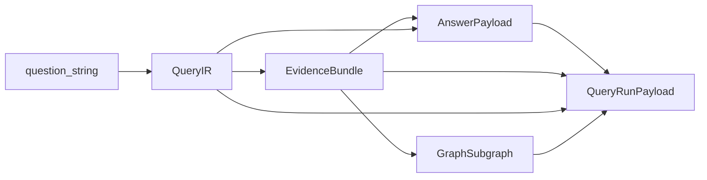

# Top-1 E0: аудит контрактов query path (Backend/ML-2)

**Дата:** 2026-07-04  
**Ветка:** `feat/top1-e0-bm2-contract-audit`  
**Этап:** E0 — baseline и аудит  
**Область:** `shared/contracts/`, `services/model/app/contracts.py`, `services/retrieval/`, `services/orchestrator/app/api/query.py`, `services/gateway/app/api/query.py`

Связанные документы: [`query_pipeline.md`](query_pipeline.md), [`docs/tz/contracts.md`](../tz/contracts.md), [`top1_parallel_execution_plan.md`](top1_parallel_execution_plan.md).

---

## 1. Цель и метод

Зафиксировать текущие поля контрактов query path, отделить **freeze points** (изменения только по явному решению команды) от **extension zones** (допустимые изменения в E1–E4 после merge gate предыдущего этапа).

Проверено по коду и тестам на `origin/dev` (2026-07-04). Новые DTO не добавлялись — только аудит.

### Карта потока данных

| Слой | Файл / endpoint | Контракт на границе |
|------|-----------------|---------------------|
| Gateway | `gateway/app/api/query.py` → `POST /query` | `QueryRunPayload` |
| Orchestrator | `orchestrator/app/api/query.py` → `POST /query/run` | `QueryRunPayload` |
| Retrieval | `retrieval/app/api/query.py` → `POST /v1/query` | `RetrievalQueryResponse` (локальный) → внутри `QueryIR` + `EvidenceBundle` |
| Model | `model/app/api/v1.py` | `QueryIRBuildResponse`, `RerankResponse`, `AnswerSynthesisResponse` (локальные обёртки) |
| Shared | `shared/contracts/models.py` | 53 Pydantic-класса; Sync 1 помечен как frozen |

---

## 2. SourceSpan

**Источник:** `shared/contracts/models.py`  
**Утилита ID:** `shared/utils/source_span.py` → `compute_source_span_id`  
**Тесты:** `shared/tests/test_contracts.py`, `shared/tests/test_source_span.py`

### Поля

| Поле | Тип | Статус | Потребители |
|------|-----|--------|-------------|
| `id` | `str` | **freeze** — auto-generate из `(document_id, page, start_offset, end_offset, table_block_id)` SHA1[:16] | retrieval Qdrant payload, orchestrator subgraph, UI source refs |
| `document_id` | `str` | **freeze** | ingestion, retrieval, knowledge |
| `page` | `int` | **freeze** | UI evidence table, export |
| `start_offset` | `int` | **freeze** | provenance |
| `end_offset` | `int` | **freeze** | provenance |
| `text` | `str` | **freeze** | synthesis input, evidence table |
| `table_block_id` | `str \| None` | **freeze** | table row spans в retrieval indexing |
| `source_type` | `"text" \| "table" \| "figure" \| "caption"` | **freeze** | Qdrant `item_type`, validation |

### Freeze points

- Алгоритм вычисления `id` и validator `ensure_id` в `SourceSpan` — breaking change для Qdrant `source_span_id`, Neo4j provenance, UI citations.
- Literal `source_type` — enum зафиксирован тестом `test_source_span_rejects_invalid_source_type`.
- Evidence-first rule (AGENTS.md): confirmed claims только с `SourceSpan` — менять семантику полей нельзя без миграции ingestion/knowledge.

### Extension zones (E2–E4)

- Дополнительные metadata **не** в `SourceSpan` — только через `NormalizedDocument.metadata` или Qdrant payload (`document_metadata`), не через изменение shared DTO.
- E3 verified/candidate split — на уровне `EvidenceItem` / model artifacts, не через новые поля `SourceSpan`.

---

## 3. QueryIR

**Источник:** `shared/contracts/models.py`  
**Построение:** `services/model/app/services.py` → `build_query_ir`  
**Endpoint:** `POST /v1/query-ir` → `QueryIRBuildResponse.query_ir`

### Поля shared DTO

| Поле | Тип | Статус | Фактическое использование |
|------|-----|--------|---------------------------|
| `id` | `str` | stable | UUID hex, не участвует в routing |
| `raw_query` | `str` | **freeze** | orchestrator question, synthesis prompt |
| `entities` | `list[str]` | stable | UI `expanded_synonyms`, rerank scoring |
| `intent` | `str` | extension | rule-based `detect_intent`; E1 planner может формализовать |
| `filters` | `dict` | **extension zone** | см. ключи ниже |
| `geo_filter` | `GeoContext \| None` | stable | дублирует первый geo из filters |
| `numeric_filter` | `Quantity \| None` | stable | дублирует первый numeric constraint |
| `source_type_filter` | `list[str] \| None` | stable | ingestion source types |
| `limit` | `int` | **freeze** | default 20; gateway/orchestrator/retrieval согласованы |
| `offset` | `int` | stable | не используется в текущем query path |

### Ключи `filters` (de-facto контракт, не типизированы)

| Ключ | Формат | Кто пишет | Кто читает |
|------|--------|-----------|------------|
| `numeric_constraints` | `list[Quantity dict]` | model `build_query_ir` | retrieval `constraints_match`, model gaps/rerank |
| `geo_constraints` | `list[str]` | model | retrieval Qdrant filter, gaps |
| `time_constraints` | `dict` (year ranges) | model | model gaps |
| `source_type_constraints` | `list[str]` | model | retrieval (косвенно через merge) |
| `aliases` | `list[str]` | model | rerank entity hints |

Gateway/orchestrator передают дополнительный `filters: dict` из request body; retrieval мержит: `query_ir.filters = {**query_ir.filters, **request.filters}`.

Search endpoint (`GET /search`) маппит query params → `filters["source_types"]`, `filters["geo_constraints"]` — **расхождение ключей** с model output (`source_type_constraints` vs `source_types`).

### Freeze points

- `raw_query`, `limit` — публичный API gateway/orchestrator.
- Структура `Quantity` и `GeoContext` в shared — используется ingestion, model, retrieval payload.

### Extension zones (E1–E4)

| Этап | Карточка | Допустимые изменения |
|------|----------|---------------------|
| E1 | bm2-ml-policy | Документировать intent taxonomy, reason codes; **не менять** shared `QueryIR` без BC-полей |
| E2 | bm2-retrieval-planner | Новые ключи в `filters` (backward-compatible), `retrieval_trace` planner metadata |
| E3 | bm2-evidence-synthesis | Verified/candidate tagging через model layer |
| E4 | bm2-orchestrator-wiring | Feature-flagged merge planner output в `filters` / trace |

---

## 4. EvidenceBundle и EvidenceItem

**Источник:** `shared/contracts/models.py`  
**Сборка:** `services/retrieval/app/api/query.py` → `run_query`  
**Мутация:** orchestrator дописывает `gaps` после `POST /v1/gaps/suggest`

### EvidenceItem

| Поле | Тип | Статус | Факт |
|------|-----|--------|------|
| `source_span` | `SourceSpan` | **freeze** | обязателен для synthesis |
| `relevance_score` | `float` | stable | rerank output |
| `claim_ids` | `list[str]` | stable | Neo4j subgraph input |
| `entity_ids` | `list[str]` | stable | Neo4j subgraph input |
| `extraction_method` | `"exact" \| "semantic" \| "table" \| "numeric" \| "geo"` | extension | **всегда `"semantic"`** в текущем retrieval path |

### EvidenceBundle

| Поле | Тип | Статус | Факт |
|------|-----|--------|------|
| `query_ir` | `QueryIR` | **freeze** | embedded copy |
| `evidence_items` | `list[EvidenceItem]` | **freeze** | synthesis input boundary |
| `total_found` | `int` | stable | = len(reranked) |
| `has_gaps` | `bool` | extension | orchestrator пересчитывает после gaps/suggest |
| `has_conflicts` | `bool` | extension | **не выставляется** в retrieval; E3 target |
| `gaps` | `list[str]` | extension | string descriptions из GapSuggestion |
| `conflicts` | `list[str]` | extension | **пусто** в production path; E3 target |

### Freeze points

- Наличие `source_span` в каждом `EvidenceItem` — access filter и synthesis завязаны на это.
- `claim_ids` / `entity_ids` — контракт с knowledge subgraph (`orchestrator/service.py` lines 393–410).

### Extension zones (E2–E4)

| Этап | Изменение |
|------|-----------|
| E2 | `extraction_method` reflect planner mode; `retrieval_trace` в orchestrator (не в shared bundle) |
| E3 | Populate `has_conflicts`, `conflicts`; verified/candidate split — предпочтительно через model `AnswerSynthesisResponse`, не ломая `EvidenceItem` shape |
| E4 | Orchestrator wiring merges planner + verification output |

### Gap: verified vs candidate layer

Shared `EvidenceBundle` **не различает** verified/candidate/conflicting/unsupported. Разделение есть только в model-local `ExtractionArtifact` (`services/model/app/contracts.py`). E3 должен либо расширить bundle BC-полями, либо держать split в synthesis response — **решение команды в E1 gate**.