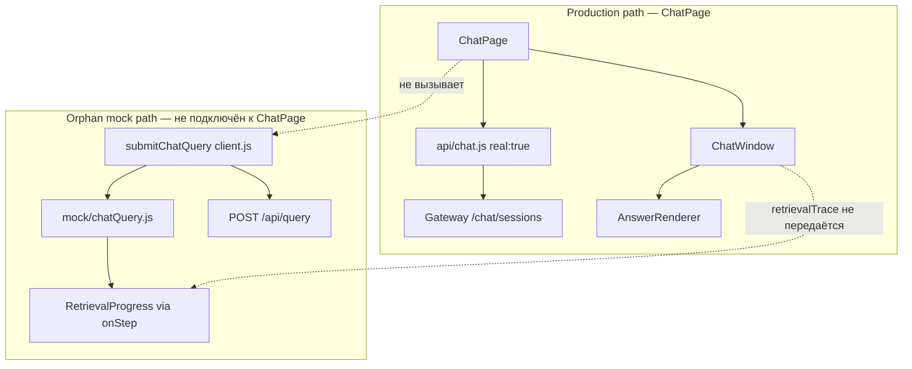
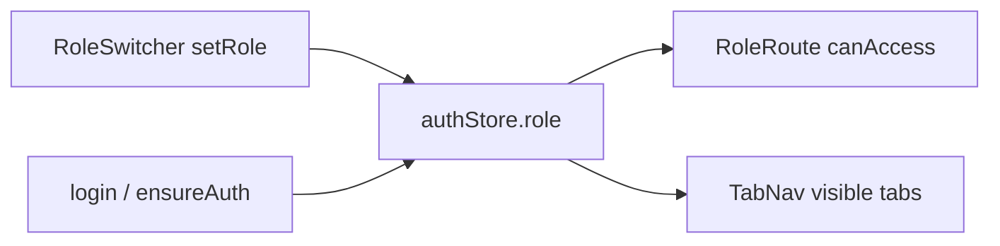

# Top-1 E0: аудит UI (Frontend)

**Дата:** 2026-07-04  
**Ветка:** `feat/top1-e0-fe-ui-audit`  
**Этап:** E0 — baseline и аудит  
**Область:** `ui/src/api/`, `ui/src/components/chat/`, `ui/src/layout/`, `ui/src/stores/`, связанные shared-компоненты источников и auth

Связанные документы: [`top1_e0_contract_audit.md`](top1_e0_contract_audit.md) (Backend/ML-2, ветка `feat/top1-e0-bm2-contract-audit`), [`top1_parallel_execution_plan.md`](top1_parallel_execution_plan.md), [`docs/tz/mvp.md`](../tz/mvp.md).

---

## 1. Цель и метод

Зафиксировать текущее состояние chat UX, mock/live границ, answer renderer и loading states. Определить **future-safe границы** (что можно делать до backend readiness) и **E5 blockers** (что переносится до merge live backend).

Проверено по коду на `origin/dev` (2026-07-04). Mock refs и RoleSwitcher **не удалялись** — только аудит.

### Карта chat-потока (фактическое состояние)



| Путь | Entry | Transport | Статус |
|------|-------|-----------|--------|
| Chat sessions | `ChatPage` → `api/chat.js` | REST, всегда `{ real: true }` | **активный** production UI |
| Query + retrieval steps | `submitChatQuery` → `api/client.js` | mock или `POST /api/query` | **реализован, не подключён** к `ChatPage` |
| Source open | `SourceLink` → `SourceDocumentContext` | mock catalog или `GET /source/{id}` | **гибрид** по `VITE_USE_MOCK` |

---

## 2. Mock boundary

### Переключатель

| Механизм | Файл | Поведение |
|----------|------|-----------|
| `VITE_USE_MOCK === 'true'` | `ui/src/utils/runtimeMode.js` | mock только при явном флаге; default live |
| `{ real: true }` в options | `api/chat.js`, `api/source.js` | обход mock для конкретных вызовов |
| `export { useMock }` | `api/client.js` | runtime-ветвление в UI-компонентах |

### Mock-артефакты (`ui/src/api/mock/`)

| Файл | Назначение | Потребители |
|------|------------|-------------|
| `index.js` | `mockFetch`, JSON seeds (ingestion, audit, admin, notifications) | `api/client.js` |
| `chatQuery.js` | `buildRetrievalSteps`, `runMockChatQuery`, `buildMockAssistantReply` | `client.submitChatQuery`, `mock/index` query route |
| `sourceCatalog.js` | `SOURCE_ENTRIES`, `resolveSourceRef`, `mergeSourceSpan`, page text | 7 UI touchpoints (см. §3) |
| `sourceBindings.js` | row/column → span id mapping, `getEvidenceRowSources` | chat EvidenceTable, graph, SourceRefsPopover |
| `*.json` | статические seeds | admin, audit, ingestion pages |

### Freeze points (E0–E4)

- Не удалять `api/mock/` и `VITE_USE_MOCK` до E5 merge gate.
- `chat.js` с `{ real: true }` — контракт с gateway chat API; менять только BC после E4 backend wiring.

---

## 3. Mock source refs — touchpoints

### Прямые импорты `api/mock/*` в UI

| Файл | Импорт | Роль | Этап выноса |
|------|--------|------|-------------|
| `context/SourceDocumentContext.jsx` | `mergeSourceSpan`, `resolveSourceRef` | fallback open source | E2 adapter, E5 live |
| `components/shared/SourceLink.jsx` | `resolveSourceRef` | citation link в mock | E2 adapter |
| `components/shared/SourceRefsPopover.jsx` | `sourceRefLabel` | подписи в popover | E2 adapter |
| `components/shared/SourceDocumentPanel.jsx` | `getDocumentViewPages` | просмотр страниц документа | E5 live |
| `components/chat/EvidenceTable.jsx` | `getEvidenceRowSources` | источники строк evidence | E2/E3 |
| `components/graph/GraphCombinationsTable.jsx` | `getCombinationRowSources`, `resolveSourceRef` | graph citations | E5 |
| `utils/downloadSource.js` | `getFullDocumentPages` | export/download | E5 live |

### Косвенные / агностичные

| Файл | Статус |
|------|--------|
| `utils/sourceRefs.js` | `collectSourceRefs` — **future-safe**, не зависит от mock |
| `utils/sourceColumn.js` | `isSourceColumnName` — layout helper |
| `hooks/useSourceRefsPopover.js` | UI state popover — без mock |
| `api/source.js` | live `fetchSource` + `mapSourcePayload` — **готов к E5** |
| `components/strategic/*`, `components/lab/CoverageMatrix.jsx` | используют `collectSourceRefs`, не mock catalog напрямую |

### Live/mock ветвление (частичная абстракция)

`SourceDocumentContext.openSource`:

1. Полный объект source → `mergeSourceSpan` (mock helper, но работает и для inline objects).
2. `!useMock && refId` → `fetchSource` (live).
3. Иначе → `resolveSourceRef` (mock catalog).

`SourceLink`: live path по `source_span_id`; mock path через `resolveSourceRef`.

**Gap D-UI-01:** нет единого `SourceResolver` — mock catalog размазан по 7 файлам. E2 `fe-source-adapter` должен централизовать без удаления mock layer.

---

## 4. Dev RoleSwitcher и auth cleanup

### Компоненты и stores

| Файл | Ответственность | Production risk |
|------|-----------------|-----------------|
| `components/shared/RoleSwitcher.jsx` | `<select>` переключения роли в runtime | **dev-only по замыслу**, виден всем в TopBar |
| `layout/TopBar.jsx` | рендерит `RoleSwitcher` без условия | E5: скрыть/изолировать |
| `stores/authStore.js` | `role`, `setRole`, `canAccess`, `ROLE_PAGES` | client-side RBAC, default `DIRECTOR` |
| `hooks/useRoleAccess.js` | обёртка `canAccess(pageKey)` | |
| `components/shared/RoleRoute.jsx` | guard маршрутов по `ROLE_PAGES` | зависит от `setRole`, не только backend |
| `api/auth.js` | mock: `MOCK_ROLE_BY_USERNAME`; live: `ROLE_MAP`, `ensureAuth` | mock role по username env |

### Auth flow



| Поведение | Mock | Live |
|-----------|------|------|
| Initial role | `DIRECTOR` (store default) | `RESEARCHER` fallback после login |
| Role override | RoleSwitcher + `setRole` | RoleSwitcher **перезаписывает** backend role |
| Page access | `ROLE_PAGES` matrix | та же matrix, не server claims |
| Token | `mock-access-token` | JWT от `/api/auth/login` |

### Freeze points

- E0–E4: **не удалять** RoleSwitcher; не менять `ROLE_PAGES` без team decision.
- E5: убрать RoleSwitcher из production path после стабильного auth/session flow (parallel plan §E5).

### Extension zones

| Этап | Допустимо |
|------|-----------|
| E1 | Подготовить feature flag / `import.meta.env.DEV` guard для RoleSwitcher (не включать в prod по умолчанию) |
| E5 | Session claims → `canAccess`; RoleSwitcher только в dev bundle или settings dev panel |

**Gap D-UI-02:** `authStore.setRole` не синхронизирован с backend `user.role` после RoleSwitcher change — E5 blocker для production RBAC.

---

## 5. Chat answer renderer

### Компоненты (`ui/src/components/chat/`)

| Компонент | Файл | Входные поля message | Статус |
|-----------|------|----------------------|--------|
| AnswerRenderer | `AnswerRenderer.jsx` | orchestrator | корневой renderer |
| ReactMarkdown | — | `content` | plain markdown, не streaming |
| EvidenceTable | `EvidenceTable.jsx` | `evidence_table` | columns/rows + mock row sources |
| SourceCitation | `SourceCitation.jsx` | `sources[]` | title, author, date, confidence_level |
| SynonymTransparency | `SynonymTransparency.jsx` | `expanded_synonyms` | статичный текст |
| WarningsPanel | `WarningsPanel.jsx` | `confidence` | только low confidence (<0.8) |
| RetrievalProgress | `RetrievalProgress.jsx` | `trace.steps[]` | done/active/pending icons |
| ExportPanel | `ExportPanel.jsx` | messages[] | md/json/pdf client-side |

### Текущий message shape (assistant)

Источник: gateway chat mapping (см. `top1_e0_contract_audit.md` §6) + mock `buildMockAssistantReply`.

| Поле UI | Backend source | AnswerPayloadV2 (E3) |
|---------|----------------|----------------------|
| `content` | `answer_text` / summary | short answer + sections |
| `sources[]` | flattened citations | verified sources only |
| `evidence_table` | bundle rows | table evidence |
| `expanded_synonyms` | `query_ir.entities` | alias transparency |
| `confidence` | `answer.confidence` | per-section confidence |
| `retrieval_trace` | `QueryRunPayload.retrieval_trace` | planner trace (не в renderer) |
| — | `warnings[]` | **не рендерится** |
| — | gaps, conflicts, follow-up | **отсутствуют** |
| — | reason codes | **отсутствуют** |
| — | verified/candidate/degraded | **отсутствуют** |

### Freeze points

- `AnswerRenderer` props `message` object — BC при E3; расширять optional fields.
- `EvidenceTable` / `SourceCitation` — не ломать до E2 source adapter.

### Extension zones (E1–E4)

| Этап | Карточка | Изменения |
|------|----------|-----------|
| E1 | `fe-chat-state` | state machine lifecycle; подключить `RetrievalProgress` к mock steps |
| E3 | `fe-answer-renderer` | conflicts, gaps, limitations, follow-up, reason codes на mock payloads |
| E4 | `fe-streaming-ux` | growing markdown, status transitions |

---

## 6. Loading states и streaming

### Текущие состояния

| Состояние | Где | Реализация |
|-----------|-----|------------|
| Page load | `ChatPage` | `loading` → `<Loader />` |
| Query in flight | `ChatPage` | `isQuerying` → disable `ChatInput` |
| Retrieval steps | `RetrievalProgress` | **не используется** ChatPage |
| Export PDF | `ExportPanel` | `exportingPdf` + button label |
| Empty chat | `ChatWindow` | placeholder text |

### Orphan: mock retrieval animation

`runMockChatQuery` (`api/mock/chatQuery.js`):

- строит steps: analyze → synonyms → per-file search/process → filter → synthesize;
- вызывает `onStep` с `{ steps, activeStepId, completed }`;
- delay 650–700 ms per step.

`submitChatQuery` (`api/client.js`) передаёт `onStep`, но **ни один page/component не вызывает** `submitChatQuery`.

`ChatWindow` принимает `retrievalTrace`, рендерит `RetrievalProgress`, но `ChatPage` передаёт только `messages`.

### Streaming

| Механизм | Статус |
|----------|--------|
| SSE / EventSource | **отсутствует** |
| WebSocket | **отсутствует** |
| Chunked markdown | **отсутствует** |
| `ReactMarkdown` full replace | единственный режим |

**Gap D-UI-03:** retrieval UX реализован наполовину — UI kit есть (`RetrievalProgress`), wiring отсутствует. E1 должен соединить state machine с mock `onStep`; E4/E5 — с backend events.

### Рекомендуемый lifecycle (E1 target)

```
parsing → retrieval → verification → synthesis → citations → done | degraded
```

Маппинг на существующие assets:

| Phase | E1 mock | E4 backend | Компонент |
|-------|---------|------------|-----------|
| parsing | instant | query_ir event | status chip |
| retrieval | `buildRetrievalSteps` | `retrieval_trace` keys | `RetrievalProgress` |
| verification | simulated delay | verification event | new panel |
| synthesis | last step | answer chunk / final | `AnswerRenderer` |
| citations | sources in reply | source_span_ids | `SourceCitation` |
| degraded | partial mock payload | warnings + gaps | extend `WarningsPanel` |

---

## 7. API layer (`ui/src/api/`)

| Модуль | Endpoints | Mock | Примечание |
|--------|-----------|------|------------|
| `client.js` | generic GET/POST/DELETE | yes | `submitChatQuery`, `mapQueryResponseToMessage` |
| `chat.js` | `/chat/sessions/*` | no (`real: true`) | ChatPage entry |
| `auth.js` | `/api/auth/*` | partial | credentials env |
| `source.js` | `/source/{id}` | no | live source viewer |
| `graph.js`, `strategic.js`, `upload.js` | domain APIs | mixed | вне chat scope E0 |

### `mapQueryResponseToMessage` (query path, не chat sessions)

Поля: `content`, `expanded_synonyms`, `confidence`, `sources`, `evidence_table`, `retrieval_trace`.

Используется только в `submitChatQuery` — **не в ChatPage flow**.

---

## 8. Layout и stores

### Layout (`ui/src/layout/`)

| Файл | Chat relevance |
|------|----------------|
| `DashboardShell.jsx` | shell: TopBar + TabNav + main |
| `TopBar.jsx` | RoleSwitcher, notifications, profile |
| `TabNav.jsx` | role-filtered navigation |
| `DashboardLayout.jsx` | `<Outlet />` wrapper |

Нет chat-specific layout; `ChatPage` использует `PageShell` + flex sidebar.

### Stores (`ui/src/stores/`)

| Store | Chat relevance |
|-------|----------------|
| `authStore.js` | role, token, user — RBAC |
| `themeStore.js` | dark mode |
| `localeStore.js` | i18n |
| `notificationStore.js` | bell — E5 export/notification deps |

**Gap D-UI-04:** нет `chatStore` / query lifecycle store — E1 создаёт с нуля.

---

## 9. Future-safe границы по этапам

### Можно до backend readiness (E1–E4)

| Задача | Этап | Файлы-touch |
|--------|------|--------------|
| Chat answer state machine + mock animated statuses | E1 | новый store/hook, `ChatPage`, `ChatWindow` |
| Подключить `RetrievalProgress` к mock `onStep` | E1 | `ChatPage` или unified query hook |
| Source resolver abstraction (mock + live behind interface) | E2 | `context/`, `utils/`, замена прямых mock imports |
| Answer renderer: conflicts, gaps, reason codes на fixtures | E3 | `AnswerRenderer`, `WarningsPanel`, новые subcomponents |
| Non-streaming authoritative fallback | E4 | `ChatPage` query hook |
| Simulated streaming / growing markdown на mock | E4 | `AnswerRenderer` |
| Feature flag нового UX | E4 | env или runtime flag |

### Только после backend merge (E5+)

| Задача | Blocker | Этап |
|--------|---------|------|
| Удаление mock source refs из live components | stable `GET /source`, bindings API | E5 |
| Удаление RoleSwitcher из production path | session claims / server RBAC | E5 |
| Реальный streaming transport | gateway SSE/WS contract | E5 |
| Live graph/source/search trace в UI | E4 orchestrator wiring merged | E5 |
| Production chat на AnswerPayloadV2 | E3 synthesis merged | E5 |
| Export/notification backend deps в UI flows | external PR stability | E5 |

### Зависимости от других ролей (merge gates)

| Frontend этап | Ждёт merge |
|---------------|------------|
| E1 | E0 audits (этот документ + contract audit) |
| E2 | E1 foundation; полезен contract audit для source_span shape |
| E3 | E1 state; mock AnswerPayloadV2 fixtures — backend E3 желателен, но plan допускает mock |
| E4 | E1–E3 + E4 `bm2-orchestrator-wiring` для real events |
| E5 | E4 + live transport/auth backend + external backend PRs |

**E0 dependency:** нет блокеров — аудит-only, backend PR не требуется.

---

## 10. Drift и рекомендации

| ID | Drift | Severity | Рекомендация | Этап |
|----|-------|----------|--------------|------|
| D-UI-01 | Mock catalog в 7 файлах без adapter | high | E2 `SourceResolver` interface | E2 |
| D-UI-02 | RoleSwitcher override backend role | high | E5 guard + session claims | E5 |
| D-UI-03 | `RetrievalProgress` disconnected | medium | E1 wire `submitChatQuery` or unified hook | E1 |
| D-UI-04 | Нет chat lifecycle store | medium | E1 zustand/hook | E1 |
| D-UI-05 | Два chat path (sessions vs query) | medium | E4 unify behind feature flag | E4 |
| D-UI-06 | `warnings[]` не рендерятся | medium | E3 `WarningsPanel` extend | E3 |
| D-UI-07 | `WarningsPanel` только confidence | low | E3 reason codes UI | E3 |
| D-UI-08 | Attachments в ChatInput не уходят в API | low | document; E4+ backend support | E4+ |
| D-UI-09 | Chat `mockFetch` throws for `/chat/*` | info | by design — sessions need backend | — |

---

## 11. Обязательные проверки для E4/E6 (UI)

После wiring и demo hardening:

1. `ui` — `npm test` (vitest): `client.test.js`, `ChatInput.test.js`, store tests.
2. `ui` — `npm run build` без ошибок.
3. `ui` — `npm run lint`.
4. Ручной smoke: chat send, retrieval steps visible, source link open (mock + live).
5. RoleRoute: access denied для restricted role без RoleSwitcher bypass в prod config.
6. Mobile layout: `RetrievalProgress` + extended answer blocks не ломают `ChatWindow` scroll (E6).

---

## 12. Итог E0

- Chat UI работает через **gateway chat sessions** (`api/chat.js`), не через `submitChatQuery`.
- Mock source layer **централизован в `api/mock/`**, но **размазан по 7 UI touchpoints** — E2 adapter обязателен до E5 cleanup.
- **RoleSwitcher** в TopBar — dev convenience; production cleanup только в E5.
- **Answer renderer** покрывает baseline shape; gaps/conflicts/reason codes/degraded — E3.
- **RetrievalProgress** и mock step engine готовы, но **не подключены** — E1 приоритет.
- **Streaming отсутствует** — E4 mock simulation, E5 live transport.
- Новый код в E0 **не требуется**; выход — этот аудит и границы для E1–E6.
